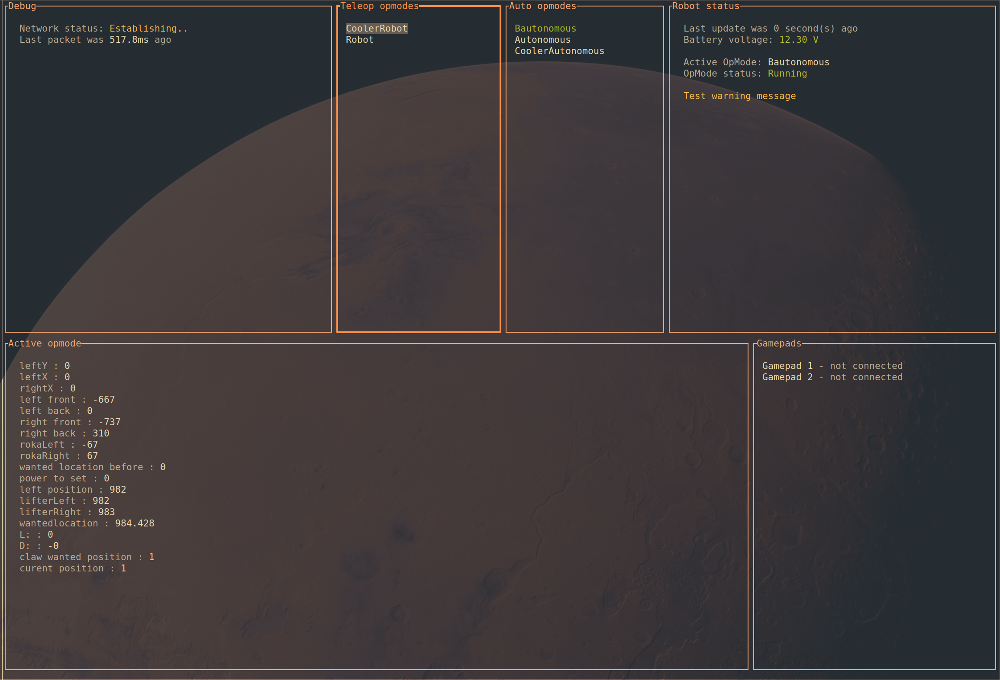

<p align="center">
	
</p>

<h1 align="center">FTC Tui</h1>

 <p align="center">
    <br />
    <a href="firsttech.si/docs/intro">Read the docs</a>
    <br />
 </p>

FTC Tui is a desktop app written in rust which aims to be a drop-in replacement for REV Robotics' Driver hub / Driver Station app.

For ease of development and performance reasons, it was created as a terminal user interface (TUI).



## FAQ

### Why create this?

We wanted to be able to drive our robots from a computer / laptop.

Ideally our software developers could work on the code and test it from the same machine.

Apart from that, having our own software drive the robot opens up exciting new possibilities - we could e. g. draw a graph from our telemetry data or just export it into a machine-parsable file, which wasn't possible before.

### How does it work?

Dark magic.

(It communicates with the Control hub in much the same way as an official Driver hub / Driver station)

### Which features are implemented?

Currently:
- core of the protocol, heartbeats, ...
- fetching info about the robot
- initializing, running and stopping OpModes (Teleop and Auto)
- driving the robot (sending gamepad data)
- telemetry

Planned:
- #6
- #1

Out of scope:
- connecting via Wi-Fi direct

## Installation

Check the [releases tab](https://github.com/firstslovenia/FTCTui/releases) and download the relevant binary for your system and CPU architecture (if you don't know what that means, choose `windows_x64`).

The .zip file contains a self-contained executable of the app. No additional things need to be installed.

### Windows

On Windows running the .exe should open the app inside a command prompt.

### Linux

To unzip the archive:

```unzip ftctui_v0.1.0_linux_x64.zip```

You may need to manually mark it as an executable:

```chmod +x ./ftctui```

You may also need to run it manually from your preferred terminal emulator:

```./ftctui```

## Usage

The app has a basic layout with 6 blocks, one of which is always selected.

You can select the next block with Tab / Right arrow, and the previous one with Shift + Tab / Left arrow.

| Block name     | Function                                                           | Useful hotkeys                                                                                                   |
|----------------|--------------------------------------------------------------------|------------------------------------------------------------------------------------------------------------------|
| Debug          | Shows network connection status and debug data                     | /                                                                                                                |
| Teleop opmodes | Shows a selectable list of Teleop opmodes                          | K / Up arrow - move selection up, J / Down arrow - move selection down; Enter - Initialize / run / stop opmode   |
| Auto opmodes   | Shows a selectable list of Autonomous opmodes                      | K / Up arrow - move selection up, J / Down arrow - move selection down; Enter - Initialize / run / stop opmode   |
| Robot status   | Shows the robot's battery voltage, running opmode and any warnings | /                                                                                                                |
| Active opmode  | Shows telemetry data from the running opmode, if any               | K / Up arrow - scroll telemetry lines up, J / Down arrow - scroll telemetry lines down                           |
| Gamepads       | Shows info about our bound gamepads                                | /                                                                                                                |

Pressing space at any point will stop or start the active opmode.

| Hotkey                   | Use                                                           |
|--------------------------|---------------------------------------------------------------|
| Tab / Right arrow        | Select next block                                             |
| Shift + Tab / Left arrow | Select previous block                                         |
| K / Up arrow             | Move selection up / Scroll up                                 |
| J / Down arrow           | Move selection down / Scroll down                             |
| Enter                    | Activate selected (initialize / run / stop OpMode)            |
| Space                    | Activate current OpMode (run if initialized, stop if running) |
| Escape                   | Go back                                                       |
| Q / Ctrl + C             | Quit                                                          |
| :                        | Open command bar                                              |

### Gamepads

To bind a connected gamepad to user 1, press the Option / Start button (the one just to the top left or left of the main buttons) and the Cross / A (bottom most) button at the same time.

To bind a connected gamepad to user 2, press the Option / Start button and the Circle / B (right most) button at the same time.

To unbind a connected gamepad, press the Option / Start button and the Square / X (left most) button at the same time.

(The Triangle / Y (top most) button is planned for navigating the UI with a controller)

### Command-line arguments

FTCTui supports passing a few extra options when running the app via command-line arguments.

To use them, you'll need to run it manually from the terminal, such as with `.\ftctui.exe --option`, `./ftctui --option` or `ftctui --option`.

#### Logging

You can pass the option `-l <LOG_LEVEL>` or `--log-level <LOG_LEVEL>` to enable logging at the specified level.

Possible levels are `error`, `warn`, `info`, `debug` and `trace`.

For example, to enable logging at the trace level (with the most messages logged, the preferred level for bug reports):

`ftctui --log-level trace`

The log file will be created at `ftctui.log`.

#### Dumping telemetry

You can pass the option `-e` or `--export-telemetry`, which will dump all telemetry packets into `telemetry_log.json` in the active directory.

[Read more about how to use this file](firsttech.si/docs/intro)

## Troubleshooting

### Network status is stuck on Establishing.., Last packet was never

This means the app can't connect to the robot.

You likely aren't connected to the right wifi network; after switching networks, try restarting the app

### My gamepad doesn't work

First please check that your OS detects the controller, such as with [https://hardwaretester.com/gamepad]

If it does, [**please open an issue**](https://github.com/firstslovenia/FTCTui/issues/new).

We'll instruct you how to create a proper binding for the controller and send it to us, so we can add official support.

### Other issues

If you encounter any other problems, especially ones that may be our fault, [**please open an issue**](https://github.com/firstslovenia/FTCTui/issues/new).

Make sure to include your current version (`ftctui --version`), operating system and potentially a log file (see [Command-line arguments -> logging](#logging)).

## Development

If you're familiar with the Rust programming language, we'll happily accept your help and patches!

Do note that we currently have not yet published documentation of the actual protocol used - this may change in the future.
